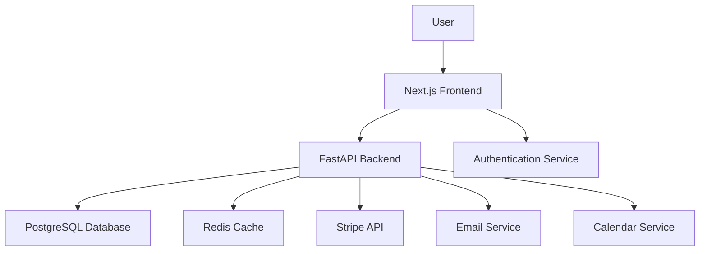

# ADR-002: Mudança de Estratégia - Plataforma Própria

**Data:** 02 de novembro de 2025
**Status:** Pronto para Validação ✅
**Responsável:** Agente de Desenvolvimento - GitHub Copilot

---

## 🎯 **Contexto**

### **Mudança de Direção dos Investidores**
Os investidores manifestaram claramente a preferência por uma **plataforma própria** desde o início, rejeitando a abordagem híbrida no-code first definida no ADR-001. Esta decisão impacta fundamentalmente a estratégia técnica e de negócio do projeto.

### **Razões dos Investidores**
- **Propriedade Intelectual:** Controle total sobre a tecnologia
- **Diferenciação Competitiva:** Capacidade de inovação exclusiva
- **Escalabilidade Controlada:** Não depender de limitações de terceiros
- **Valorização da Startup:** Plataforma própria aumenta valuation
- **Experiência do Usuário:** Controle total sobre UX/UI

### **Impacto na Estratégia Atual**
A decisão ADR-001 (No-Code First + Code Enhancement) torna-se **inválida** e precisa ser substituída por uma abordagem **Code-First** desde o início.

---

## 🔍 **Nova Opção Considerada**

### **Opção 4: Code-First - Plataforma Própria ⭐ (NOVA ESTRATÉGIA)**

**Descrição:** Desenvolver plataforma completa própria desde o MVP, usando tecnologias modernas e escaláveis.

**Stack Técnica Proposta:**
- **Frontend:** Next.js 14 + TypeScript + Tailwind CSS
- **Backend:** FastAPI (Python) + PostgreSQL
- **Autenticação:** JWT + OAuth2
- **Pagamentos:** Stripe/PagSeguro API (não interface)
- **Infraestrutura:** Vercel (frontend) + Railway/Fly.io (backend)
- **Monitoramento:** Sentry + LogRocket

**Prós:**
- ✅ Controle total sobre produto e experiência
- ✅ Propriedade intelectual 100%
- ✅ Diferenciação competitiva máxima
- ✅ Escalabilidade ilimitada
- ✅ Valorização superior para investimento

**Contras:**
- ❌ Tempo de desenvolvimento maior (8-12 semanas)
- ❌ Custos iniciais mais altos
- ❌ Risco técnico maior
- ❌ Curva de aprendizado da equipe

**Estimativa de Esforço:** 120-160 horas (vs 30-50h no-code)

---

## ✅ **Nova Decisão**

### **Opção Escolhida: Code-First - Plataforma Própria**

**Justificativa baseada nos requisitos dos investidores:**

1. **Propriedade Intelectual:** Plataforma própria garante controle total
2. **Diferenciação Competitiva:** Capacidade de inovação exclusiva
3. **Valorização da Startup:** Produto único aumenta valuation
4. **Experiência do Usuário:** Controle total sobre UX/UI
5. **Escalabilidade:** Não limitado por restrições de plataformas terceiras

### **Nova Arquitetura Definida**

#### **Componentes Principais**

- **Frontend (Next.js):**
  - Landing page e marketing
  - Dashboard do usuário
  - Sistema de agendamento
  - Área administrativa

- **Backend (FastAPI):**
  - API REST para todas as operações
  - Autenticação e autorização
  - Processamento de pagamentos
  - Gerenciamento de sessões

- **Banco de Dados (PostgreSQL):**
  - Usuários e perfis
  - Sessões e agendamentos
  - Pagamentos e transações
  - Relatórios e analytics

---

## 🎯 **Consequências da Mudança**

### **Positivas**
- **Valor da Startup:** Aumento significativo no valuation
- **Controle Total:** Propriedade intelectual completa
- **Inovação:** Capacidade de diferenciação competitiva
- **Escalabilidade:** Sem limitações de plataformas terceiras

### **Desafios a Serem Gerenciados**
- **Tempo de Desenvolvimento:** +8-12 semanas no cronograma
- **Custos Iniciais:** +R$ 15-20K em desenvolvimento
- **Riscos Técnicos:** Maior complexidade inicial
- **Recrutamento:** Necessidade de devs full-stack

### **Riscos e Mitigações**

#### **Risco: Atraso no Lançamento**
- **Mitigação:** Desenvolvimento modular, MVP focado em core features
- **Plano B:** Beta privado com funcionalidades limitadas

#### **Risco: Custos Excessivos**
- **Mitigação:** Orçamento controlado, desenvolvimento por etapas
- **Controle:** Revisões semanais de progresso vs orçamento

#### **Risco: Complexidade Técnica**
- **Mitigação:** Stack madura e bem documentada
- **Qualidade:** Code reviews rigorosos, testes automatizados

---

## 📅 **Novo Roadmap Ajustado**

### **Fase 1: Core Platform (8 semanas)**
- Setup Next.js + FastAPI + PostgreSQL
- Autenticação e cadastro de usuários
- Sistema básico de agendamento
- Integração Stripe para pagamentos

### **Fase 2: Features Essenciais (4 semanas)**
- Dashboard do usuário
- Sistema de notificações por email
- Área administrativa
- Relatórios básicos

### **Fase 3: Otimização e Lançamento (4 semanas)**
- Performance e UX/UI polimento
- Testes de carga e segurança
- Documentação e deploy
- Lançamento beta

### **Total Estimado:** 16 semanas (vs 4 semanas no-code)

---

## 💰 **Impacto Financeiro**

### **Custos Adicionais**
- **Desenvolvimento:** R$ 15-20K (vs R$ 3-5K no-code)
- **Infraestrutura:** R$ 500/mês (vs R$ 200/mês no-code)
- **Timeline:** +12 semanas para lançamento

### **ROI Esperado**
- **Valorização:** +200-300% no valuation da startup
- **Receita:** Controle total sobre monetização futura
- **Concorrência:** Vantagem competitiva sustentável

---

## 🔄 **Próximos Passos**

### **Imediatos (Esta Semana)**
1. ✅ **Revisar ADR-001** - Marcar como superseded
2. ✅ **Criar ADR-002** - Documentar nova decisão
3. ⏳ **Atualizar Roadmap** - Novo cronograma code-first
4. ⏳ **Revisar Stack Técnica** - Confirmar tecnologias
5. ⏳ **Atualizar Backlog** - Novas tasks de desenvolvimento

### **Semana Seguinte**
- Definir arquitetura detalhada
- Criar wireframes e protótipos
- Iniciar desenvolvimento do core
- Contratar recursos adicionais se necessário

---

## 📝 **Documentação Relacionada**

- **ADR-001:** Superseded - No-Code First (anterior)
- **Business Baseline:** Mantém validade (visão, receita, mercado)
- **Gate de Qualidade:** EPIC/SPIN/SMART ainda aplicáveis
- **Planning:** Necessita revisão completa

---

**Status:** 🔄 Aguardando validação final dos investidores
**Próxima Revisão:** 09 de novembro de 2025
**Impacto:** Mudança fundamental na estratégia técnica e cronograma</content>
<parameter name="filePath">c:\repo\projetos\meu-pdi\docs\adrs\ADR-002-plataforma-propria.md